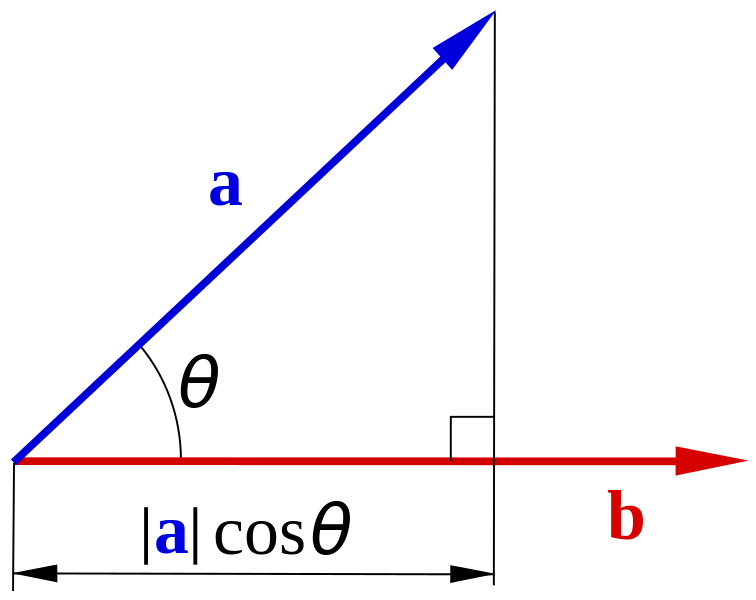

class: center, middle

## Conceptes Avançats de Programació

# Exemple de transpes en markdown


.small[[source](https://www.inverse.com/article/31467-artificial-intelligence-computer-human-game)]

Gerard Escudero, 2024


---
class: left, middle, inverse

# Outline

* .cyan[Taula]

* Fòrmules

* Altres

---

# Classification Data Example

.center[
class      | sepal <br> length | sepal <br> width | petal <br> length | petal <br> width 
:--------- | -----: | ----: | -----: | ----: 
setosa     | 5.1    | 3.5   | 1.4    | 0.2 
setosa     | 4.9    | 3.0   | 1.4    | 0.2 
versicolor | 6.1    | 2.9   | 4.7    | 1.4 
versicolor | 5.6    | 2.9   | 3.6    | 1.3 
virginica  | 7.6    | 3.0   | 6.6    | 2.1 
virginica  | 4.9    | 2.5   | 4.5    | 1.7 
150 rows or examples (50 per class).red[*] 
]

* The .blue[class] or .blue[target] column is usually refered as vector .blue[_Y_] 

* The matrix of the rest of columns (.blue[attributes] or .blue[features]) is usually referred
as matrix .blue[_X_]

.footnote[.red[*] _Source_ : _Iris_ problem UCI repository (Frank & Asunción, 2010)]

---
class: left, middle, inverse

# Outline

* .brown[Taula]

* .cyan[Fòrmules]

* Altres

---

# Distance-based methods

### Induction principle: .blue[distances]

- **euclidean**:

$$de(v, w) = \sqrt{\sum_{i=1}^n(v_i-w_i)^2}$$

$$n=\text{\#attributes}$$

- **hamming**:

$$dh(v, w) = \frac{\sum_{i=1}^n \delta(v_i, w_i)}{n} $$
$$\delta(a, b)=1\text{, if } a\neq b$$
$$\delta(a, b)=0\text{, if } a = b$$ 

---
class: left, middle, inverse

# Outline

* .brown[Taula]

* .brown[Fòrmules]

* .cyan[Altres]

---

# sklearn

#### .blue[Classification]:

```python3
from sklearn.neighbors import KNeighborsClassifier
KNeighborsClassifier(3)
```

#### .blue[Regression]:

```python3
from sklearn.neighbors import KNeighborsRegressor
KNeighborsRegressor(1)
```

#### Usual parameters:

```python3
KNeighborsClassifier(k, weights='distance')
# for weighted majority votes or average
```

#### User guide: 

.tiny[[https://scikit-learn.org/stable/modules/neighbors.html](https://scikit-learn.org/stable/modules/neighbors.html)]


---

# Naïve Bayes

#### .blue[Learning Model]

$$\text{model}=[P(y)\simeq\frac{N(y)}{N},P(x_i|y)\simeq\frac{N(x_i|y)}{N(y)};\forall y \forall x_i]$$

.col5050[
.col1[
| $y$       | $P(y)$ |
|:----------|-------:|
| poisonous | 0.429  |
| edible    | 0.571  |
]
.col2[
| attr:value       | poisonous | edible |
|:-----------------|----------:|-------:|
| cap-shape:convex | 1         | 0.5    |
| cap-shape:bell   | 0         | 0.5    |
| cap-color:brown  | 0.33      | 0      |
| cap-color:yellow | 0         | 0.5    |
| cap-color:white  | 0.67      | 0.5    |
| gill-size:narrow | 1         | 0      |
| gill-size:broad  | 0         | 1      |
| gill-color:black | 0.33      | 0.25   |
| gill-color:brown | 0.33      | 0.75   |
| gill-color:pink  | 0.33      | 0      |
]
]

---

# Linear Classifier

.cols5050[
.col1[

#### Given: 
$P$: positive centroid <br>
$N$: negative centroid <br>
$\langle,\rangle$: dot product 

#### Formulae:

$h(T)=sign\left(\langle W,T\rangle+b\right)$

where:

$W=P-N$ 

$b=\frac{1}{2}(\langle P,P\rangle-\langle N,N\rangle)$

#### Implementation:

([html](codes/cl.html) / [ipynb](codes/cl.ipynb))
]
.col2[


.center[.tiny[[https://sv.wikipedia.org/wiki/Fil:Scalar-product-dot-product.svg](https://sv.wikipedia.org/wiki/Fil:Scalar-product-dot-product.svg)]]


]]


